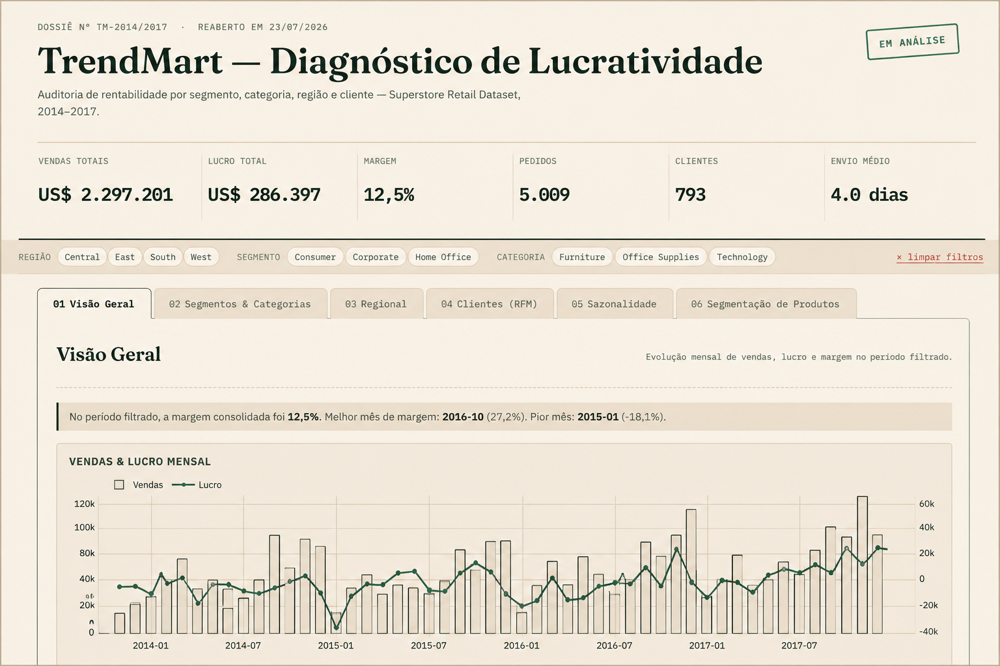

# TrendMart Profitability Analysis

> End-to-end Business Analytics project focused on profitability analysis, customer segmentation, and executive decision support.

<p align="center">
  <a href="https://lnoveli.github.io/trendmart-profitability-analysis/">
    
  </a>
</p>

<p align="center">


</p>

<p align="center">

🚀 <a href="https://lnoveli.github.io/trendmart-profitability-analysis/">Open Interactive Dashboard</a>

</p>

---

## Executive Summary
**Live Dashboard:** https://github.com/lnoveli/trendmart-profitability-analysis

---

# Executive Summary

TrendMart is a fictional retail company facing a common business challenge: high sales do not necessarily translate into high profitability.

Using over 9,900 retail transactions between 2014 and 2017, this project investigates the drivers behind financial performance by combining exploratory analysis, feature engineering, customer segmentation, and an interactive dashboard.

The final solution delivers actionable business insights rather than descriptive visualizations, allowing decision-makers to identify profitability issues, understand customer behavior, and prioritize strategic actions.

---

# Business Problem

Executives need to answer questions such as:

- Which products generate revenue but destroy profit?
- How do discounts affect operating margins?
- Which customer segments create the highest business value?
- Are there seasonal sales patterns worth exploring?
- Which regions consistently underperform?

Answering these questions supports pricing strategy, customer retention, and operational efficiency.

---

# Business Questions

This analysis was designed to answer five key business questions:

1. Where does the company lose profitability?
2. Which customer profiles generate the highest lifetime value?
3. How strongly do discounts impact margins?
4. Are there seasonal opportunities throughout the year?
5. Which categories and regions deserve strategic attention?

---

## 💼 Business Impact

This analysis supports strategic decision-making by transforming transactional retail data into actionable business insights.

Key outcomes include:

- Identified the most profitable customer segments to support targeted marketing strategies.
- Highlighted low-margin products and categories for pricing and portfolio optimization.
- Revealed sales patterns that can improve inventory planning and demand forecasting.
- Enabled executive monitoring through an interactive dashboard for faster, data-driven decisions.

---

# Dataset

**Source**

Sample Superstore Dataset (Tableau Community)

**Period**

2014 – 2017

**Records**

- 9,994 sales transactions
- Orders
- Customers
- Products
- Regions
- Categories

---

# Project Architecture

```
trendmart-profitability-analysis/

├── assets/
├── dashboard/
│   ├── index.html
│   ├── app.js
│   ├── style.css
│   └── data.json
│
├── data/
│   └── superstore.csv
│
├── notebooks/
│   └── analise_exploratoria.ipynb
│
├── src/
│
├── build_data.py
├── requirements.txt
└── .gitignore
```

---

# Analytical Methodology

The project follows a complete Business Analytics workflow:

## Data Preparation

- Data cleaning
- Missing value validation
- Feature engineering
- Date processing
- Profitability metrics

## Feature Engineering

Additional business metrics were created, including:

- Profit Margin
- Shipping Time
- Discount Flag
- RFM Metrics
- Customer Lifetime Indicators

## Customer Segmentation

Customer segmentation was performed using:

- RFM Analysis
- Standardization
- K-Means Clustering

Final customer groups:

- Champions
- Loyal Customers
- At Risk
- Occasional Customers

## Product Analysis

Subcategories were clustered according to profitability patterns to identify products requiring managerial attention.

## Seasonality Analysis

Monthly sales behavior was analyzed across four years to distinguish long-term growth from recurring seasonal effects.

---

# Interactive Dashboard

The dashboard was built using pure HTML, CSS, JavaScript, and Plotly.js.

Users can interactively filter data by:

- Region
- Segment
- Category

The dashboard updates visualizations in real time without requiring any backend service.

---

# Key Business Insights

The analysis reveals several practical insights, including:

- High revenue products are not always profitable.
- Discount policies significantly affect margins.
- Customer value is highly concentrated in a small group of clients.
- Some categories consistently destroy value despite strong sales.
- Seasonal patterns create opportunities for inventory and pricing optimization.

---

# Business Recommendations

Based on the analysis, the following strategic actions are recommended:

- Review aggressive discount policies.
- Prioritize retention of high-value customer segments.
- Reevaluate low-margin product categories.
- Optimize inventory according to seasonal demand.
- Develop region-specific commercial strategies.

---

# Technologies

### Data Analysis

- Python
- Pandas
- NumPy

### Machine Learning

- Scikit-learn
- K-Means
- StandardScaler

### Visualization

- Plotly.js

### Front-End

- HTML5
- CSS3
- JavaScript

---

# Repository Structure

| Folder | Purpose |
|----------|---------|
| data | Raw dataset |
| notebooks | Exploratory Data Analysis |
| dashboard | Interactive application |
| assets | Images and documentation |
| src | Reusable source code |

---

# Running Locally

Install dependencies

```bash
pip install -r requirements.txt
```

Generate dashboard data

```bash
python build_data.py
```

Run local server

```bash
python -m http.server 8000
```

Open:

```
http://localhost:8000
```

---

# Future Improvements

- SQL pipeline integration
- Automated ETL workflow
- Power BI version
- Cloud deployment
- Docker support
- CI/CD pipeline
- Unit testing

---

# Author

**Leonardo Noveli**

Physiotherapist transitioning into Business Analytics with interests in Business Intelligence, Data Analytics, AI, and Digital Transformation.

**LinkedIn**

https://www.linkedin.com/in/leonardonoveli/

**GitHub**

https://github.com/lnoveli

---

## Disclaimer

This project uses the Tableau Sample Superstore dataset for educational purposes.

The project was developed with the support of generative AI tools during implementation while maintaining full responsibility for the analytical design, business interpretation, validation, and final technical decisions.
